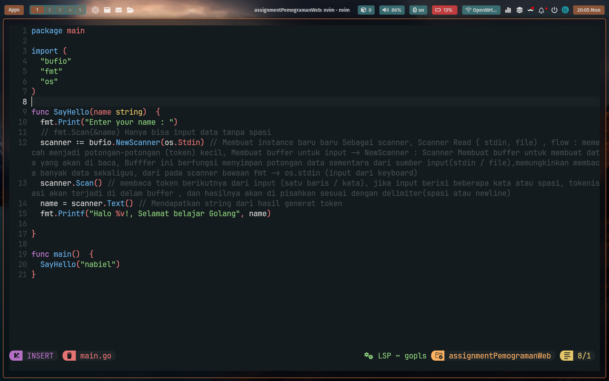
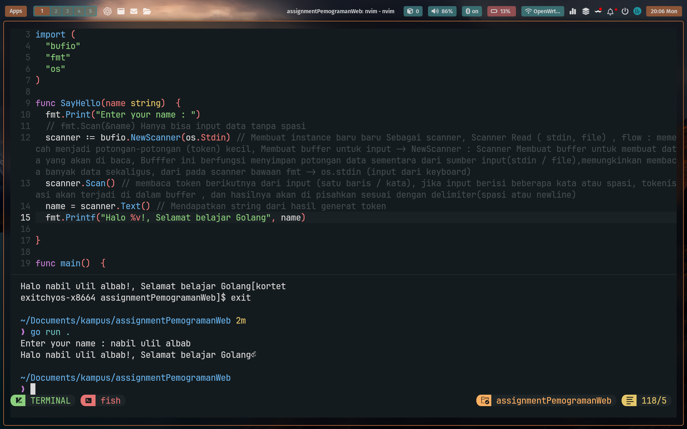

# Assignment Pemrograman Web

Ini adalah proyek untuk pembelajaran pemrograman web menggunakan bahasa Go (Golang). Proyek ini menggunakan beberapa fitur dasar dari Go, seperti `bufio.Scanner` untuk membaca input dari pengguna. 

## Deskripsi

Pada program ini, pengguna akan diminta untuk memasukkan nama mereka, dan program akan mencetak pesan selamat datang yang menyapa pengguna tersebut. Program ini menggunakan `bufio.NewScanner` untuk memungkinkan input yang mengandung spasi, berbeda dengan `fmt.Scan` yang hanya bisa menangani input tanpa spasi.

## Cara Menggunakan

1. **Clone repository ini** ke mesin lokal Anda:

    ```bash
    git clone https://github.com/yourusername/assignmentPemogramanWeb.git
    ```

2. **Masuk ke folder proyek**:

    ```bash
    cd assignmentPemogramanWeb
    ```

3. **Jalankan aplikasi**:

    Pastikan Anda telah menginstal Go di sistem Anda. Jika sudah, jalankan perintah berikut:

    ```bash
    go run main.go
    ```

4. Program akan meminta Anda untuk memasukkan nama, setelah itu akan mencetak pesan sambutan dengan nama yang Anda masukkan.

## Contoh Output

Jika Anda menjalankan program ini dan memasukkan nama "Nabil", outputnya akan terlihat seperti berikut:

```
Enter your name: Nabil
Halo Nabil!, Selamat belajar Golang
```

## Gambar

Berikut adalah screenshot dari tampilan program saat dijalankan:




## Penjelasan Kode

Pada kode utama, fungsi `SayHello(name string)` melakukan hal berikut:
1. Meminta pengguna untuk memasukkan nama mereka menggunakan **`bufio.NewScanner`** yang lebih efisien untuk menangani input dengan spasi.
2. Scanner akan membaca input dari **stdin** dan memisahkannya menjadi token (kata atau baris).
3. Setelah pengguna memasukkan nama mereka, program mencetak pesan selamat datang dengan nama yang diberikan.

### Kode:

```go
package main

import (
	"bufio"
	"fmt"
	"os"
)

func SayHello(name string)  {
  fmt.Print("Enter your name : ")
  // fmt.Scan(&name) Hanya bisa input data tanpa spasi
  scanner := bufio.NewScanner(os.Stdin) // Membuat instance baru Sebagai scanner
  scanner.Scan() // Membaca token berikutnya dari input (satu baris / kata)
  name = scanner.Text() // Mendapatkan string dari hasil generat token
  fmt.Printf("Halo %v!, Selamat belajar Golang", name)
}

func main()  {
  SayHello("nabiel")
}
```

## Teknologi yang Digunakan
- **Go (Golang)**: Bahasa pemrograman yang digunakan untuk mengembangkan program ini.
- **bufio.NewScanner**: Digunakan untuk membaca input yang mengandung spasi dengan efisien.

## License

Distribusi kode ini dilakukan di bawah lisensi MIT.

### Penjelasan mengenai README.md:
- **Deskripsi Proyek**: Penjelasan singkat tentang apa yang dilakukan program ini dan fitur utama.
- **Cara Menggunakan**: Langkah-langkah yang dapat diikuti pengguna untuk menjalankan proyek ini.
- **Contoh Output**: Memberikan gambaran tentang hasil yang diharapkan ketika program dijalankan.
- **Gambar**: Memasukkan dua screenshot yang ada di folder proyek untuk menunjukkan tampilan aplikasi atau penggunaan.
- **Penjelasan Kode**: Bagian ini menjelaskan bagaimana program bekerja dan memberikan contoh kode untuk referensi.
- **Teknologi yang Digunakan**: Menyebutkan alat yang digunakan dalam proyek ini.

Gambar akan ditampilkan selama file `screenshot_24022025_200500.jpg` dan `screenshot_24022025_200630.jpg` berada di folder yang sama dengan README.md.

